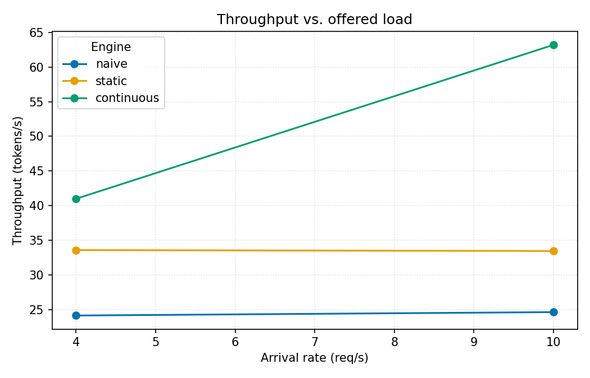

# nanoserve

[](https://colab.research.google.com/github/Savi-Swar/nanoserve/blob/main/notebooks/nanoserve_gpu.ipynb)

A from-scratch LLM inference server in Python and PyTorch, no custom CUDA. The
model is a stock Qwen2.5-0.5B. The part I built is the scheduler, the layer that
decides how requests share the GPU. The repo then uses it as an audit rig to test
which published inference optimizations actually help on realistic workloads.



## Results (fp16, one T4)

| engine | throughput | vs naive | p99 TTFT |
|---|---|---|---|
| naive | 29.1 tok/s | 1x | 52 s |
| static batching | 142.9 tok/s | 4.9x | 7.7 s |
| continuous batching | 278.5 tok/s | 9.6x | 2.0 s |
| paged KV cache | 237.2 tok/s | 8.1x | 2.6 s |

Continuous batching is 9.6x naive throughput and reaches 16% of vLLM (1,708
tok/s) with masked SDPA and no fused kernels. Measured as goodput (requests/sec
meeting a 500 ms TTFT / 50 ms TPOT SLO) it sustains roughly 200x naive, which
meets that SLO on almost no requests once its queue backs up.

## What it found

- Speculative decoding is a net loss under batching on generic traffic. I built
  speculation inside the continuous batch (token-exact) and measured it drop from
  0.97x to 0.40x as the batch grows on generic prose, while staying a 2-5x win on
  repetitive text. That matches a cost model that predicts the win/loss crossover
  from acceptance rate and the roofline batch size. The usual "2.7x speculative
  decoding" figure is a batch-1, grounded-workload number.
- Static batching has the worst TTFT tail of any engine on the real Azure trace,
  worse than naive, from head-of-line blocking. The synthetic benchmark hid this.
- Paged KV cuts fragmentation from 68% to 4% (3x more sequences per byte) but runs
  about 16% slower than continuous, past the noise floor. It buys capacity, not
  speed.
- 8-bit KV is nearly free (perplexity 27.9 vs 28.7 fp16, half the memory). Prefix
  caching saves 70% of prefill on shared prompts. My naive 4-bit quantizer falls
  apart (perplexity 443).

Method, tables, and the numbers that didn't hold up are in
[docs/writeup.md](docs/writeup.md).

## The audit

Implement published optimizations one at a time in a rig I control, ablate each
in isolation, and measure them on workloads I pick instead of the one each paper
picked for itself. Everything is measured past a noise floor (`make noise`) and
checked token-exact against naive before any speed number.

| optimization | result | `make` |
|---|---|---|
| spec decoding, batch 1 | 2.7x on repetitive text, 1.0x on generic. A workload property, not a method one. | `spec` |
| spec decoding, in the batch | net loss on generic once you batch (0.97x to 0.40x), 2-5x win on grounded. Matches the cost model. | `spec-batched` |
| prefix caching | holds up: 70% of prefill saved on a shared prompt, ~0 without, output identical | `prefix` |
| KV quantization | 8-bit nearly lossless (ppl 27.9 vs 28.7), 4-bit collapses (443) | `kvquant` |
| goodput under SLO | continuous sustains ~200x naive's sustainable load | `goodput` |
| roofline crossover | predicted B* around 39; measured knee at B~4 on a T4 (real overheads pull it ~10x in) | `crossover` |
| scale axis | cost model predicts the moving crossover (B* 39→53→82; generic spec crossover stays 2→4, so the inversion is robust to scale); GPU columns at 1.5B/3B pending | `scale-predict` / `scale` |
| chunked prefill | left out; its payoff is tail latency the noise floor would bury | |

## Running it

```bash
pip install -r requirements.txt
make all                 # memory ablation + engine sweep + graphs -> results/
make audit               # spec + prefix + KV-quant ablations
make bench DEVICE=cuda    # the sweep on a GPU
```

`make` with no target lists everything. The full GPU pipeline (ladder, trace,
audit, batched-spec, goodput, vLLM ceiling) is one command,
`python scripts/gpu_run.py`, or the Colab/Kaggle notebook linked above. See
[docs/gpu_run.md](docs/gpu_run.md). There's also a Dockerfile:

```bash
docker build -t nanoserve . && docker run --rm -v $(pwd)/results:/app/results nanoserve
```

## Serving

It runs as an actual HTTP server with a real request lifecycle, not just a
benchmark loop. Concurrent clients land in one shared queue and the continuous
batcher serves them together.

```bash
python serve.py --engine paged --port 8000 --log    # --device cpu on Apple Silicon

curl -s localhost:8000/healthz
curl -s localhost:8000/metrics
curl -s  -XPOST localhost:8000/generate -d '{"prompt":"The capital of France is","max_tokens":16}'
curl -sN -XPOST localhost:8000/generate -d '{"prompt":"Tell me a story","max_tokens":64,"stream":true}'
```

- **Backpressure / load shedding** — a request is admitted only while the queue is
  under `--max-queue`; past that it's a 503 instead of an unbounded queue. A 20-way
  burst against a 6-deep queue served 7 and shed 13.
- **Cancellation on disconnect** — `stream:true` streams tokens over SSE; when a
  client hangs up, the engine evicts that sequence from the running batch mid-step
  and returns its KV blocks to the pool. `make cancel-chaos` proves zero block
  leakage across thousands of abort cycles (allocator stress + the real paged engine
  killing a random subset of each batch mid-stream).
- **Timeouts** (`--request-timeout`), **graceful shutdown** (SIGTERM drains
  in-flight work), and **structured per-request logs** (`--log`: `queued →
  scheduled → first_token → finished|cancelled|timeout`, traceable by id).

`/metrics` is Prometheus text:

```
$ curl -s localhost:8000/metrics
nanoserve_requests_accepted_total 5
nanoserve_requests_cancelled_total 4
nanoserve_requests_timed_out_total 0
nanoserve_queue_depth 0
nanoserve_throughput_tokens_per_second 8.8
nanoserve_ttft_p99_ms 464.5
```

## The ladder

Four engines, each a step up from the last:

```
naive           one request at a time             baseline
static batching wait for N, run together          GPU idles when short reqs finish
continuous      evict finished, admit waiting     slot reused right away
paged KV cache  block allocator + free list        3x concurrency per byte
```

Paged stores KV in fixed blocks from a free list, so a sequence grows on demand
instead of reserving room for the longest length it might reach. On 64
length-skewed sequences that drops fragmentation from 68% to 4%. It costs about
16% throughput against the contiguous engine because the per-step block gather is
real work even after vectorizing it. The gain is capacity under memory pressure.

## Correctness

Batched, paged, speculative (single-sequence and in-batch), and prefix-cached
decoding are all checked token-for-token against naive single-sequence decoding
under greedy, including 1-token prompts, permutation across batch positions, block
boundaries, and speculative accept/reject. These change speed and memory, not the
output. Separately, a chaos harness asserts the KV block pool never leaks under
cancellation: every block is always either free or in exactly one sequence, across
thousands of mid-stream abort cycles (`make cancel-chaos`).

```bash
python -m pytest -q                                        # fast tests
RUN_SLOW=1 python -m pytest tests/test_equivalence.py -q    # the token-exactness oracle (loads the model)
```

## Layout

```
server/
  request.py       Request + SamplingParams, latency/SLO properties
  model.py         ModelRunner: prefill / decode / decode_many, sampling
  batched.py       BatchState: left-padded contiguous batched KV
  paged_cache.py   BlockAllocator: free list, block tables, fragmentation metrics
  paged_exec.py    PagedKVStore + PagedBatchState: KV in blocks, vectorized gather
  speculative.py   single-sequence prompt-lookup speculative decoding
  spec_batched.py  speculative decoding inside the continuous batch (paged)
  prefix_cache.py  prefix KV reuse
  kv_quant.py      low-bit KV cache quantization
  engine.py        naive / static / continuous / paged / spec-in-batch engines
  service.py       HTTP service: submit-and-wait, backpressure/load shedding, /metrics
serve.py           run it as a server: POST /generate, GET /metrics, GET /healthz
bench/
  workload.py      open-loop Poisson load generator + prompt bank
  trace.py         Azure LLM inference trace replay
  synthetic_trace.py  synthetic long-context (RAG-style) workload
  metrics.py       throughput, TTFT/e2e/queue/TPOT tails, goodput
  gpu.py           nvidia-smi utilization sampler (no-op off CUDA)
  run_bench.py     one engine, one workload -> report
  sweep.py         engine x rate grid -> results/sweep.json
  repeat.py        N-run stats: mean, 95% CI, noise floor
  memory_study.py  KV fragmentation ablation
  cancel_chaos.py  block-leak chaos harness: cancel/abort cycles, zero-leak invariant
  goodput_study.py req/s meeting a TTFT + TPOT SLO
  spec_study.py    speculative decoding tokens/forward (batch 1)
  spec_batched_study.py  spec-in-batch vs continuous
  spec_cost.py     analytical spec speedup / crossover model
  prefix_study.py  prefix caching prefill savings
  kv_quant_study.py  KV quant memory vs perplexity
  trace_compare.py all engines on the real trace
  roofline.py      analytical throughput ceiling + predicted crossover
  crossover_study.py  measured vs predicted decode crossover batch
  scale_predict.py predicted moving crossover across model size (GPU-free)
  scale_study.py   rerun the audit at 0.5B / 1.5B / 3B
  regression.py    perf-regression gate for CI
  plot.py          sweep grid -> PNGs
  vllm_ref.py      vLLM reference ceiling
scripts/gpu_run.py   the whole GPU pipeline -> results/summary.txt
notebooks/           Kaggle/Colab GPU + scale notebooks
docs/                writeup.md, research.md, frontier/, gpu_run.md
tests/               fast tests + a guarded token-exactness oracle
```

On Apple Silicon, MPS matmul is broken for this model, so dev happens on CPU
(`--device cpu`). Real numbers come from a CUDA GPU (`--device cuda`).

## CI

GitHub Actions runs `pytest -q` (fast tests, no GPU) and a perf-regression gate
(`bench.regression --check`) that fails the build if paged fragmentation or
allocator throughput regresses past a threshold. It uses a deterministic no-model
proxy so CI needs no GPU. Refresh the baseline with `bench.regression --update-baseline`.

## License

MIT, see [LICENSE](LICENSE).
